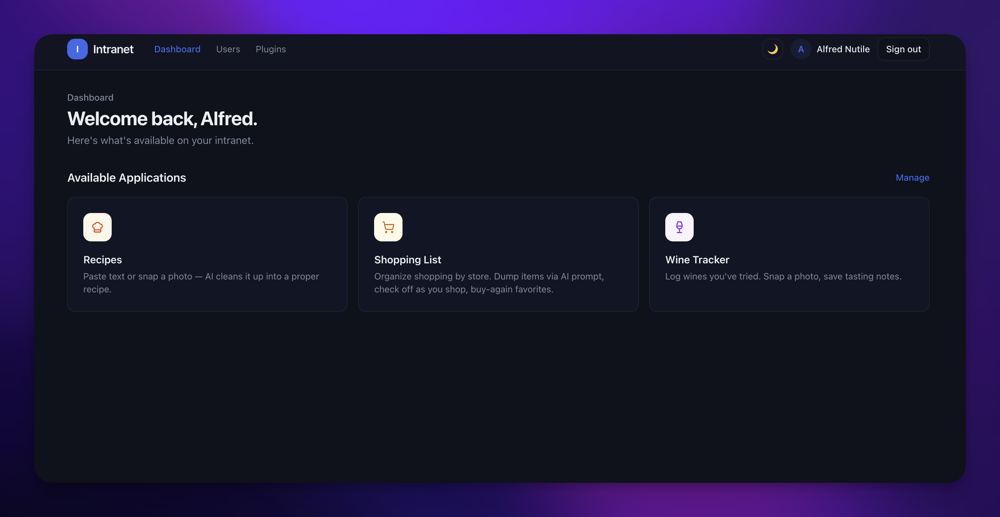

# Intranet Platform

A self-hosted, open-source **plugin host for private React apps**. One
deployment, one login, as many personal apps as you want — wine tracker,
recipes, shopping lists, whatever you vibe-code next.



Think WordPress, but instead of a CMS you get a plugin system for real
React apps behind invite-only auth. Plugins can use the built-in SQLite,
or bring their own backend (Supabase, a public API, whatever).

## Highlights

- **Closed-by-default.** First user = admin. Everyone else needs an invite.
- **Install plugins from GitHub** — paste a URL, it clones, builds, and hot-mounts without a restart.
- **AI-powered plugins** — the bundled apps use Claude Vision for label scanning, recipe extraction, and natural-language list parsing.
- **Dark mode** — toggle in the nav, respects system preference.
- **SQLite on disk** — zero config, one file, backed up by copying it.

## Bundled plugins

| Plugin | What it does |
| --- | --- |
| **Wine Tracker** | Snap a photo of a label → Claude reads it → auto-fills name, winery, vintage, region. Rate later, search, filter. |
| **Recipes** | Paste messy text or photograph a recipe → Claude structures it into ingredients, steps, times, tags. |
| **Shopping List** | Organize by store. Dump items via AI prompt. Check off as you shop, star favorites for buy-again. |

## Quick start

```bash
git clone https://github.com/alnutile/intranet-platform.git
cd intranet-platform
docker compose up --build
```

Open **http://localhost:3001**, register, done. Add `ANTHROPIC_API_KEY` to
your `.env` for AI features.

### Without Docker

```bash
npm install
npm run setup     # creates .env with a random SESSION_SECRET
npm run build     # builds the host client
npm start         # Express on :3001
```

Dev mode (hot reload both sides):

```bash
npm run dev       # server :3001 + Vite :5173
```

## Using this as your own intranet

This repo is meant to be **cloned, not forked** — you'll add your own
plugins, your own data, your own `.env`. But you'll also want to pull in
upstream improvements (new platform features, security fixes, UI polish)
without losing your local changes.

Here's the workflow:

### 1. Clone and set your own origin

```bash
git clone https://github.com/alnutile/intranet-platform.git my-intranet
cd my-intranet

# Point origin at your own private repo (GitHub, Gitea, wherever).
git remote rename origin upstream
git remote add origin git@github.com:you/my-intranet.git
git push -u origin main
```

Now `origin` is yours and `upstream` points back here.

### 2. Add your own plugins

Drop folders into `apps/`. Your plugins, your commits, your `origin`.
The platform doesn't care where plugins come from — they follow the same
contract whether they're bundled, installed from GitHub, or hand-coded.

### 3. Pull upstream updates

When this repo ships something you want:

```bash
git fetch upstream
git merge upstream/main
```

**Why this works cleanly:** the platform code lives in `server/` and
`client/`. Your plugins live in `apps/`. Merge conflicts are rare because
you're changing different directories. If we update a bundled plugin
(e.g. wine-tracker) and you've customized it, you'll get a normal merge
conflict that you resolve once.

### 4. Ignore bundled plugins you don't want

Don't want the wine tracker? Delete `apps/wine-tracker/` and commit.
Upstream updates to that plugin will be no-ops since the directory
doesn't exist in your tree.

## Writing a plugin

Full contract: [`docs/APP_SPEC.md`](docs/APP_SPEC.md)

Minimum:

```
my-plugin/
├── manifest.json              # { id, name, icon, entry }
└── client/src/main.tsx        # exports default mount(el, ctx)
```

With server + SQLite:

```
my-plugin/
├── manifest.json
├── migrations/001_init.sql    # tables prefixed app_<id>_
├── server/index.ts            # exports Express Router
└── client/src/main.tsx
```

Plugins that talk to Supabase or a third-party API skip the server
and migrations entirely — just ship the manifest and the client.

## Installing a plugin from GitHub

**Admin → Plugins → Install from GitHub** → paste a repo URL → Install.
The platform clones it, validates the manifest, builds the client,
runs migrations, and hot-mounts the server routes. No restart needed.

## Environment variables

| Variable | Required | Description |
| --- | --- | --- |
| `SESSION_SECRET` | Yes | Random string for cookie signing. Auto-generated by `npm run setup`. |
| `DATABASE_PATH` | No | SQLite path. Default: `./persist/app.db` |
| `UPLOAD_DIR` | No | File uploads. Default: `./persist/uploads` |
| `ANTHROPIC_API_KEY` | No | Enables AI features (wine label scanning, recipe parsing, shopping list AI). |
| `PORT` | No | Server port. Default: `3001`. |

## Project layout

```
server/src/           Platform server (Express, SQLite, auth, plugin loader)
client/src/           Platform client (React, Tailwind, shadcn-style UI)
apps/                 Plugins live here
  wine-tracker/       Bundled: wine logging with AI label scan
  recipes/            Bundled: recipe management with AI extraction
  shopping-list/      Bundled: store-based shopping lists with AI prompt
docs/
  APP_SPEC.md         Plugin contract specification
```

## Roadmap

See [ROADMAP.md](ROADMAP.md) for the full plan. Next up:

- In-app AI builder (describe an app → Claude scaffolds it)
- MCP server so Claude Code / Cursor can build plugins from outside
- In-app Monaco editor with AI assist

## License

MIT
